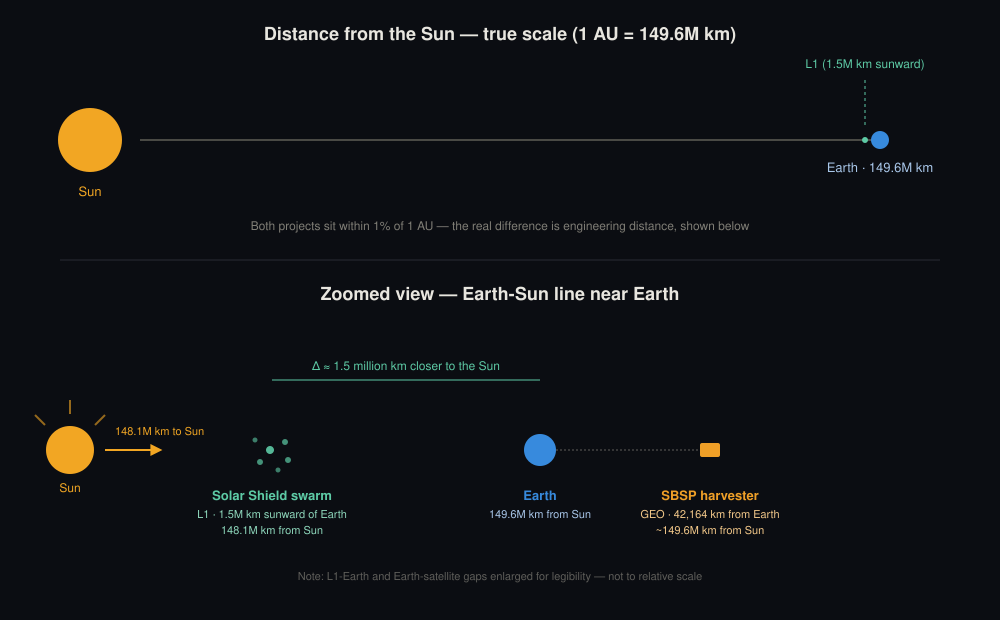

Two projects, one star, two very different orbital regimes.

::: {layout-ncol=2}

::: {.card}
### Solar Shield Swarm
Reflective sail swarm stationed near Sun-Earth L1, designed to reduce solar insolation reaching Earth.

**Status:** concept / early design
**Distance from Sun:** ~148.1M km

[Read more →](projects/solar-shield-swarm.qmd)
:::

::: {.card}
### SBSP Harvester
Solar energy collection satellite in Earth orbit, beaming power to a ground rectenna.

**Status:** concept
**Distance from Sun:** ~149.6M km

[Read more →](projects/sbsp-harvester.qmd)
:::

:::

## How far apart are they, really?

At solar-system scale, both projects sit within about 1% of Earth's own distance from the Sun (1 AU = 149.6 million km). The L1 swarm is roughly 1.5 million km closer — the point where Earth's and the Sun's gravity balance. That gap is small on the scale of the solar system, but it is the entire difference between a deep-space mission with no easy servicing and a satellite living in Earth's own orbital neighborhood.

{fig-alt="Diagram comparing the Solar Shield swarm at L1 (148.1 million km from the Sun) and the SBSP harvester in Earth orbit (149.6 million km from the Sun)"}
