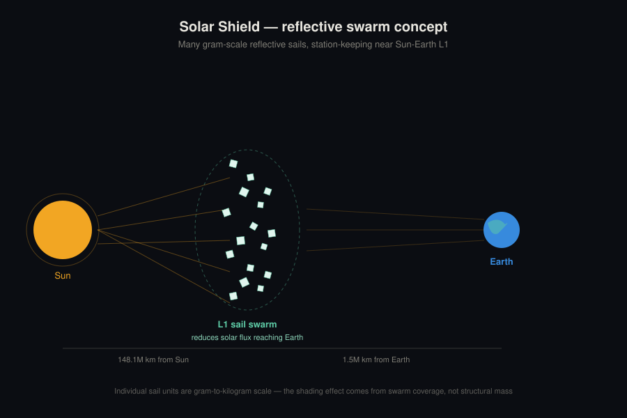

## Concept

A distributed swarm of ultra-lightweight reflective sails, individually gram-to-kilogram scale, stationed near the Sun-Earth L1 Lagrange point — roughly 1.5 million km sunward of Earth, where the Sun's and Earth's gravity balance. The shading effect comes from swarm coverage area, not from any single structure's mass.

{fig-alt="Illustration of many small reflective sails clustered near Earth's L1 point, partially blocking sunlight from reaching Earth"}

## Why a swarm, not one shade

Classic single-occulter sunshade proposals run into mass problems fast — full-scale occulting disks are estimated at 10⁷–10⁸ tonnes, roughly the scale of a major terrestrial civil engineering project. A swarm of many small, thin-film sails spreads that same shading area across many cheap, individually replaceable units, and trades a small amount of shading efficiency for a much lower total launch mass.

Current research (like the [Planetary Sunshade Foundation)(https://planetarysunshade.org/)'s work, funded via [ARIA](https://aria.org.uk/)) focuses on ultra-light "solar sail" style films — a giant solar sail spanning roughly one million square kilometers, claimed to cool the planet by about one degree.

## Open engineering questions

- **Station-keeping**: L1 is an unstable equilibrium — every sail needs active or passive correction to avoid drifting off station.
- **Swarm geometry**: coverage vs. collision-avoidance vs. correction-burn budget is a genuinely open combinatorial/control problem.
- **Individual sail design**: reflectivity, film thickness, attitude control, and survivability against micrometeorites.

## Distance from the Sun

~148.1 million km — about 1.5 million km closer to the Sun than Earth itself, and closer than any Earth-orbiting satellite by definition.
